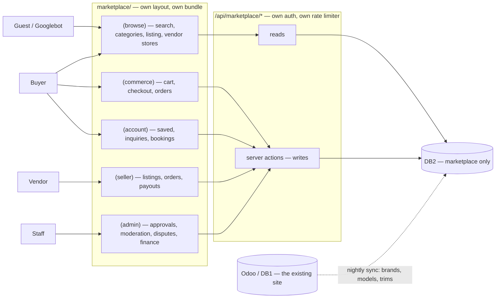
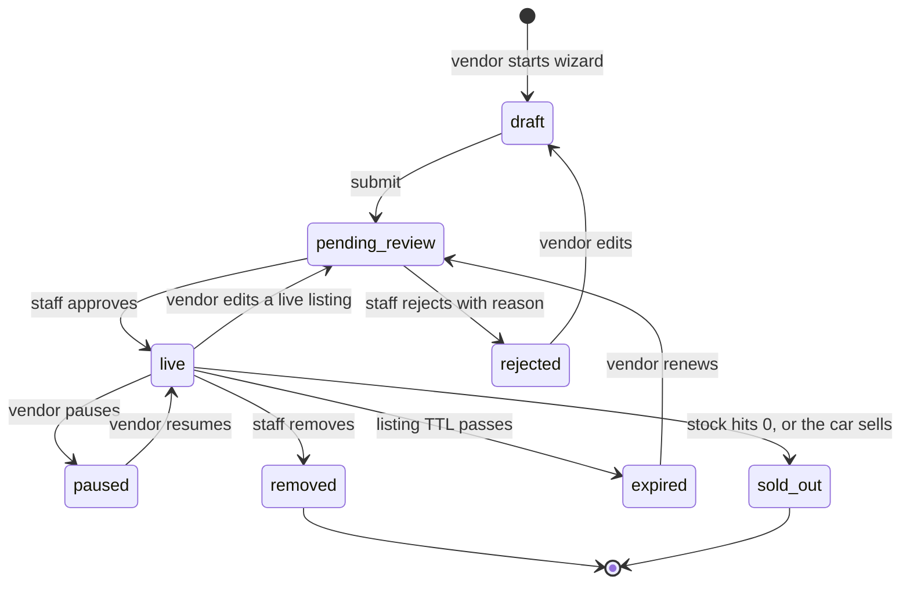
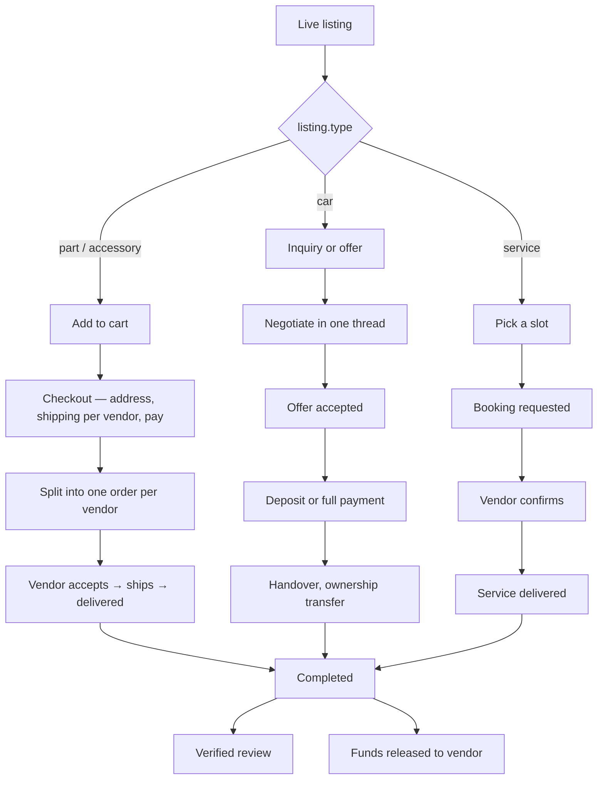
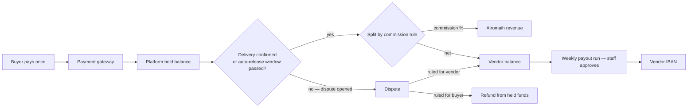
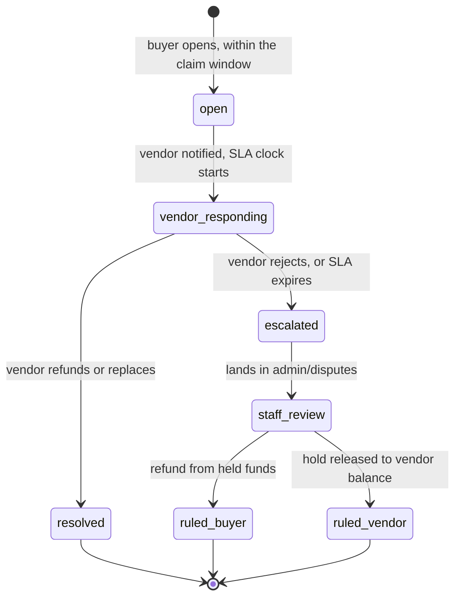
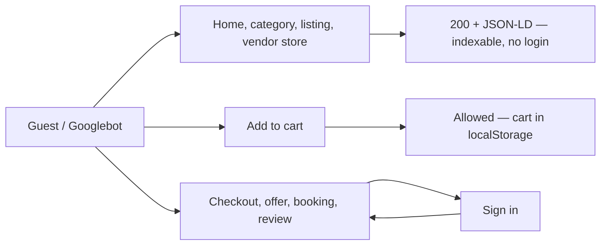
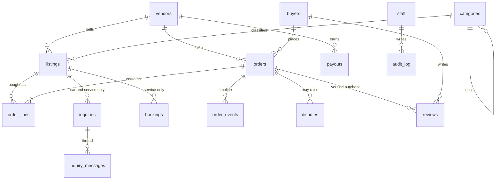

# Marketplace — Corrected Workflow

Companion to [MARKETPLACE-STRUCTURE.md](MARKETPLACE-STRUCTURE.md). That doc says where
code lives; this one says how the system behaves.

This replaces the earlier C2C car-selling flowchart. That diagram modelled **individuals
selling cars by negotiation**. What is being built is a **multi-vendor marketplace** where
sellers list parts, cars, services and accessories — which changes the transaction model,
the money model, and the schema.

---

## 1. What changed, and why

| earlier diagram | corrected | reason |
|---|---|---|
| `Cars` table | `listings` + `type` + `attributes(jsonb)` | one table serves parts, cars, services, accessories |
| individual sellers | `vendors` with storefronts, verification, commission | it's multi-vendor, not C2C |
| offer/negotiation only | three paths, chosen by `listing.type` | a brake pad cannot be bought by negotiation |
| `Payments`, `Subscription` floating | held funds → commission split → payout run | the money path was undefined |
| nothing after `Sold` | dispute state machine | "it never arrived" had no home |
| `Messages` + `Offers` + `Negotiation` | one `inquiries` thread with typed events | three nodes, one concept |
| auth ahead of everything | guest browses, auth gates the action | Googlebot never logs in |

Nothing from the original is lost — the listing lifecycle, admin approval, role dashboards
and review loop were all correct and are carried forward below.

---

## 2. System map

Who talks to what, and where the isolation boundary sits.

`ODOO -.-> DB2` is the only line crossing the boundary, it runs on a cron, and it goes one
way. No marketplace page read ever touches the site's database — that is what keeps the two
independently deployable.

---

## 3. Listing lifecycle

Carried over from the original diagram, which had this right. Applies to all four types.

Two details the original missed:

- **`live --> pending_review`** — editing a live listing re-enters moderation. Without this
  a vendor gets a cheap listing approved, then edits it into something else.
- **`expired`** — listings must die on their own. A marketplace full of stale ads is the
  single fastest way to lose search trust.

---

## 4. The three transaction paths

**This is the correction that matters.** The type of the listing decides how it is bought.

The original flow modelled only the middle branch. All three converge on the same
completion event, which is what makes one reviews table and one payout run possible.

Routes already scaffolded for each branch:

| branch | entry route | action file |
|---|---|---|
| part / accessory | `(commerce)/cart`, `(commerce)/checkout` | `checkout/_actions/place-order.js` |
| car | `(browse)/listing/[slug]` | `listing/[slug]/_actions/inquiry.js` |
| service | `(browse)/listing/[slug]` | `listing/[slug]/_actions/booking.js` |

---

## 5. Money

The largest gap in the original. `Payments` and `Subscription` were nodes with no path
through them.

Three rules this encodes:

1. **The buyer pays once**, even for a cart spanning three vendors. The split happens after
   capture, never at the card.
2. **Funds are held, not forwarded.** Paying a vendor on order-placed makes every refund a
   debt-collection problem.
3. **Commission is computed at capture** and stored on the order. Changing the fee table
   later must not silently reprice historical orders.

---

## 6. Disputes

The SLA expiry edge is the important one. Without it a vendor closes a dispute by ignoring
it.

---

## 7. Guest vs authenticated

Every page that should rank is reachable without a session. Auth gates the **action**, not
the content. The original diagram put `Authentication` between the landing page and
everything else — that would have made the whole marketplace invisible to search.

---

## 8. Data model

`orders ||--o{ reviews` rather than `listings ||--o{ reviews` is deliberate: a review must
be anchored to a completed transaction, or the ratings are worthless.

---

## 9. Still open

Decisions this flow assumes but that nobody has actually made yet:

- **Claim window** — how many days a buyer can open a dispute. Drives the auto-release timer.
- **Commission** — flat rate, or per type and category. §5 assumes a rule table either way.
- **Car payments** — does a car transact on-platform at all, or is the marketplace only the
  introduction and the money happens at the branch? This changes whether the `car` branch
  touches the money flow.
- **Vendor onboarding bar** — CR and VAT required for every vendor, or a lighter tier for
  individuals selling one car?
- **Login** — shared with the main site, or separate. See structure doc §6.
